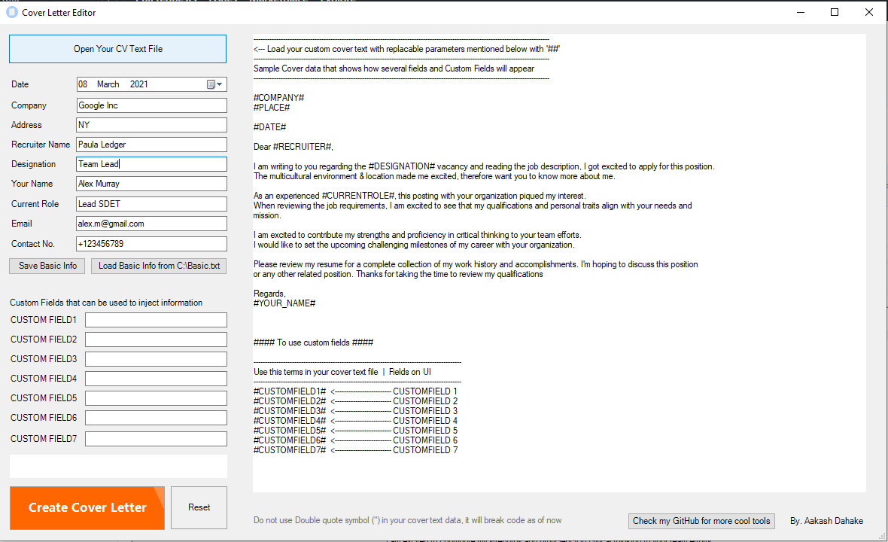

# Cover-Letter-Editor

Being job seekers, We know the importance of the cover letter we submit to an employer. That makes an initial impression about our profile.

In the effortful journey of job-seeking, I found myself modifying my cover letter many times, as per Employer, Date, Target Designation and Current Role, and other important factors we update in my cover letter data.

I would like to introduce to GUI based tool I made, which makes updating your cover content easy -

## How to use it?
- Create a cover letter of your choice in text file.
- Now place #COMPANY#, #PLACE#, #DATE#, #RECRUITER#, #DESIGNATION#, #CURRENT_ROLE#, #YOUR_NAME#, #EMAIL#, #CELL# terms in your CL file, where you want your enetered data will appear
- You can use #CUSTOMFIELD1# to #CUSTOMFIELD7# to use these fields in your cover letter content file if required
- Open Cover Letter Editor tool and click on <Open You CV Text File> button and select the template file you created in above steps
- Select Date (it takes current date when opened)
- Fill out neccessary data like Comapny Name, Address, Recruiter Name, Designation, Current Role, Your name, email and contact. (Customfields if you have used in your cover letter file)
- Click on <Create Cover Letter> button and you can that your COver letter is created in right text box, you can copy that and use.

## What is [Save Basic info] & [Load basic info from C:\Basic.txt>\]?

### [Save Basic info] button saves Your Name,Current Role,Email, and Contact number fields to a test file created on C drive with name=Basic.txt
Looks like 
 {
	"Name": "Alex Murray",
	"CurrentRole": "Lead SDET",
	"Email": "alex.m@gmail.com",
	"Cell": "+123456789"	
}

### [Load basic info from C:\Basic.txt]
Load above information for you from C:\Basic.txt so that you don't need to enter same details again and again you use this tool.

# Screenshot

